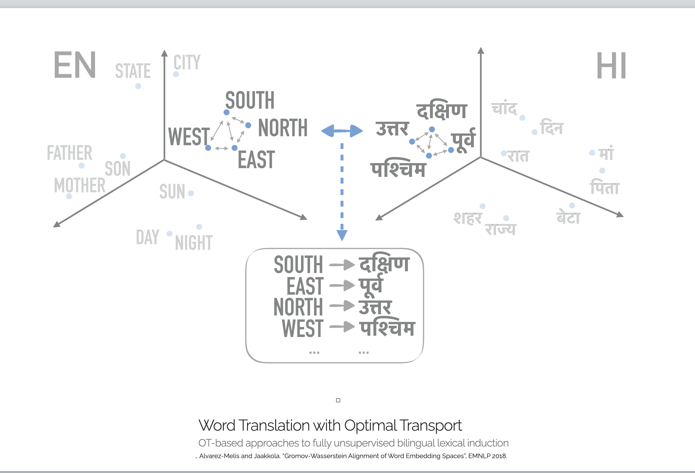

#  Optimal Transport based methods in Data Science
### MATH 8610 - Spring 2023

## Instructor: http://facundo-memoli.org/
## Times: MoWe 1:50PM - 3:10PM 
## Room: Bolz Hall 128
## Credits: 3
## Assessment: Lectures/projects and/or TBA

## Course Description

The last few years have seen the rapid development of mathematical methods for the analysis of data arising in machine learning, biology and computer vision applications, amongst others.

Some recently developed tools coming from the field of Optimal Transport (OT) have proved to be particularly successful for tasks such as feature extraction, clustering, data matching and comparison, domain adaptation, etc.

Some ideas from OT are naturally found in probability theory in the form of the Wasserstein distance between probability measures on a Polish space. This notion of distance metrizes weak convergence of measures and has a lot of interesting properties which interact nicely with synthetic notions of Ricci curvature on metric measure spaces.

The Wasserstein can be gromovized in different ways to produce notions of distance (often called Gromov-Wasserstein distances) between datasets which have found many applications in machine learning in recent years. 

On the theoretical front, Sturm has found that some quasi-Riemannian structures can be identified for a certain variant of this distance in a context in which it becomes possible to even consider gradient and heat flows of metric measure spaces – concepts which have potential applications to data science (in the form of objective based data processing, or data smoothing).

This course will focus on theoretical aspects as well as on applications.

## References: 
This course will be based on my own lecture notes but will also follow material from several recent research and expository papers such as:

[Mem11] Memoli, Facundo. “Gromov–Wasserstein distances and the metric approach to object matching.” Foundations of computational mathematics 11.4 (2011): 417- 487.

[Sturm12]Sturm, Karl-Theodor. “The space of spaces: curvature bounds and gradient flows on the space of metric measure spaces.” arXiv preprint arXiv:1208.0434 (2012).

and also chapters from the following books:

[Villani21] Villani, Cedric. “Topics in optimal transportation.” Vol. 58. American Mathemat- ical Soc., 2021.

[PeyreCuturi19] Peyre, Gabriel, and Marco Cuturi. “Computational optimal transport: With ap- plications to data science.” Foundations and Trends in Machine Learning 11.5-6 (2019): 355-607.

[Villani09] Villani, Cedric. “Optimal transport: old and new.” Vol. 338. Berlin: Springer, 2009. 
